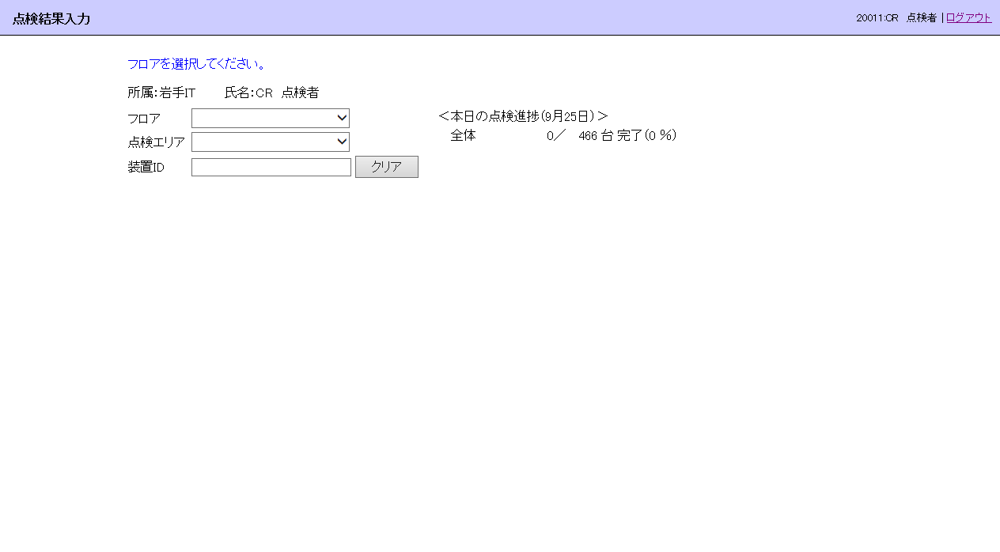
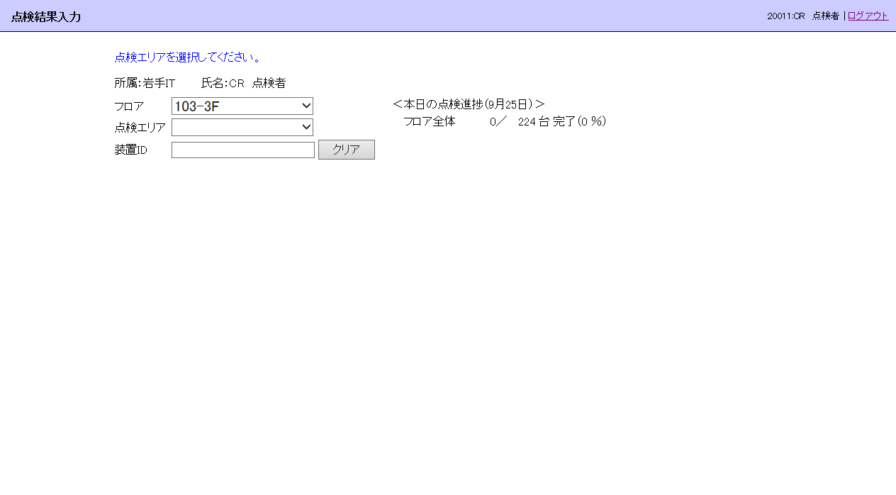
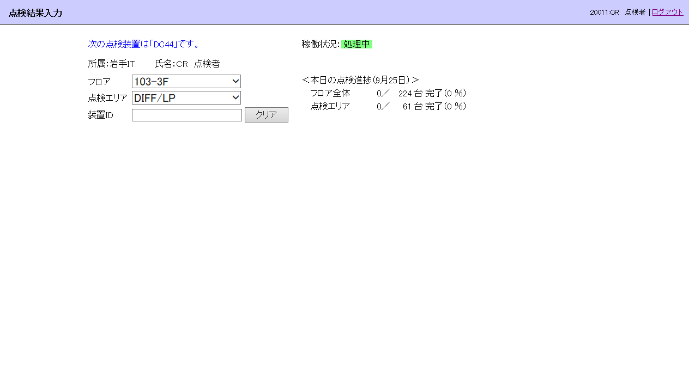
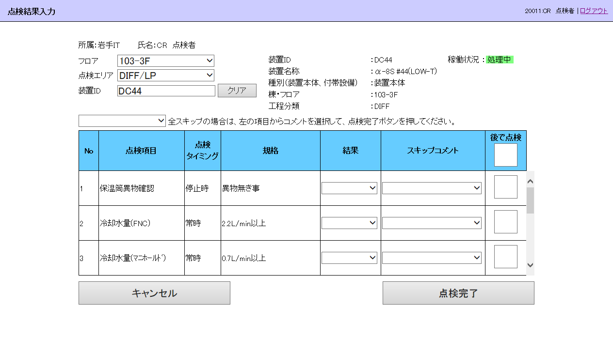

= 点検結果入力（タブレット）機能
v1.0, 2017-10-01
:lang: ja
:encoding: utf-8
// :doctitle: これがドキュメントタイトルになります。
:description: 文書の説明を書きます。metaタグのdescriptionに設定されます。
:keywords: カンマ区切りでキーワードを書きます。metaタグのkeywordsに設定されます。
// :title: titleタグに設定されます。
:docinfo: shared
:docinfodir: meta
:sectids!:
:linkcss:
:hardbreaks:

== 概要

装置別に、点検日当日に点検対象である項目の点検結果を入力します。

== 画面

=== イメージ

.初期表示 フロアを選択させる
[caption="図 1: "]

.フロアの選択後、点検エリアを選択させる
[caption="図 2: "]

.点検エリアの選択後、点検する装置のIDを入力させる
[caption="図 3: "]

.装置IDの入力後、点検項目の点検結果を入力させる
[caption="図 4: "]

=== 項目

==== 情報メッセージ欄

情報メッセージを表示する。文字色は青。

==== エラーメッセージ欄

エラーメッセージを表示する。文字色は赤。

==== 所属

ログインユーザーの所属を表示する。

==== 氏名

ログインユーザーの氏名を表示する。

=== フロア

点検するフロアを選択する。 +
後で点検にした装置の再点検時は、表示のみとし入力は禁止する。

=== 点検エリア

点検する点検エリアを選択する。 +
後で点検にした装置の再点検時は、表示のみとし入力は禁止する。

=== 装置ID

点検する装置のIDを入力する。 +
入力された文字はシステムが自動で半角大文字に変換する。 +
(変換はサーバーで実施）

=== クリア

装置IDをクリアする。

== 機能

=== 初期設定（フロア未選択）

==== 情報メッセージ

「フロアを選択してください。」と表示。

==== フロアセレクトボックス

リスト値を設定する。 +
点検日当日に点検対象の項目を持つ装置のフロア。 +
ただし、点検対象項目すべてが点検済みである装置は除く。

==== 点検エリアセレクトボックス

リスト値をクリアする。

==== 装置IDテキストボックス

入力値をクリアする。

// ==== 本日の点検進捗
// 
// ===== ヘッダーラベル
// 
// 日付:: 点検日当日（m月d日形式）
// 
// 
// ===== 全体
// 
// 形式:: 「分子／分母（進捗率）」
// 分子:: 点検日当日に点検対象の項目すべてが点検済みの装置の数
// 分母:: 点検日当日に点検対象の項目を持つ装置の数
// 進捗率:: 分子÷分母（小数点以下四捨五入）×100　←要確認

=== フロア変更

==== 情報メッセージ

「点検エリアを選択してください。」と表示。

==== 点検エリアセレクトボックス

選択したフロアに属し、点検対象の項目を持つ装置の点検エリアをリスト値に設定する。 +
ただし、点検対象項目すべてが点検済みの装置は除く。 +
最下行に空行を設定する。

==== 装置IDテキストボックス

入力値をクリアする。

// ==== 本日の点検進捗
// 
// ===== ヘッダーラベル
// 
// 日付:: 点検日当日（m月d日形式）
// 
// 
// ===== フロア全体
// 
// 形式:: 「分子／分母（進捗率）」
// 分子:: 選択フロアに属し、点検日当日に点検対象の項目すべてが点検済みの装置の数
// 分母:: 選択フロアに属し、点検日当日に点検対象の項目を持つ装置の数
// 進捗率:: 分子÷分母（小数点以下四捨五入）×100　←要確認

=== 点検エリア変更

==== 情報メッセージ

「次の点検装置は「≪次回点検対象装置ID≫」です。」と表示。

例: 「次の点検装置は「DC44」です。」

===== 次回点検対象装置の決め方

選択フロア/点検エリアに属する、点検対象項目がある装置で、点検結果が一件も登録されていない装置。 +
「装置点検順マスター」の点検順の昇順に判定し、最初に条件を満たした装置とする。

==== 装置IDテキストボックス

入力値をクリアする。

==== 稼動状況

次回点検対象装置の稼働状況を表示。

// ==== 本日の点検進捗
// 
// ===== ヘッダーラベル
// 
// 日付:: 点検日当日（m月d日形式）
// 
// 
// ===== フロア全体
// 
// 形式:: 「分子／分母（進捗率）」
// 分子:: 選択フロアに属し、点検日当日に点検対象の項目すべてが点検済みの装置の数
// 分母:: 選択フロアに属し、点検日当日に点検対象の項目を持つ装置の数
// 進捗率:: 分子÷分母（小数点以下四捨五入）×100　←要確認
// 
// 
// ===== 点検エリア全体
// 
// 形式:: 「分子／分母（進捗率）」
// 分子:: 選択フロア/点検エリアに属し、点検日当日に点検対象の項目すべてが点検済みの装置の数
// 分母:: 選択フロア/点検エリアに属し、点検日当日に点検対象の項目を持つ装置の数
// 進捗率:: 分子÷分母（小数点以下四捨五入）×100　←要確認

=== 本日の点検進捗

==== 表示制御

ヘッダーラベルには点検日当日を「m月d日」形式で表示する。

フロアが未選択であれば、「全体」の進捗を表示する。 +
フロアだけ選択されていれば、「フロア全体」の進捗を表示する。 +
フロアと点検エリアが選択されていれば、「フロア全体」と「点検エリア」の進捗を表示する。 +
装置IDまで入力されていれば、何も表示しない。

==== 表示内容

===== 共通

形式:: 「分子／分母（進捗率％）」
進捗率:: 分子÷分母×100（小数点以下四捨五入）　←端数処理は要確認

表示例:: 50／100（50％）

===== 全体

分子:: 点検日当日に点検対象の項目すべてが点検済みの装置の数
分母:: 点検日当日に点検対象の項目を持つ装置の数

===== フロア全体

分子:: 選択フロアに属し、点検日当日に点検対象の項目すべてが点検済みの装置の数
分母:: 選択フロアに属し、点検日当日に点検対象の項目を持つ装置の数

===== 点検エリア

分子:: 選択フロア/点検エリアに属し、点検日当日に点検対象の項目すべてが点検済みの装置の数
分母:: 選択フロア/点検エリアに属し、点検日当日に点検対象の項目を持つ装置の数

